# ARQUITECTURA_CHATWOOT_V1.md - SARA

## Objetivo
Definir el primer flujo vertical de SARA: recibir mensajes desde Chatwoot, filtrarlos, agruparlos durante 20 segundos, registrarlos y dejarlos listos para procesamiento trazable.

## Alcance inicial autorizado
- Cuenta Chatwoot: `6`
- Inbox Chatwoot: `44`
- Conversacion Chatwoot: `20`
- Evento aceptado: `message_created`
- Direccion aceptada: mensaje entrante del usuario
- URL publica webhook: `POST https://sara.codexa.uy/api/v1/webhooks/chatwoot`

Todo evento fuera de este alcance se registra como descartado y no se procesa.

## Flujo completo previsto

```mermaid
flowchart LR
  A["Chatwoot webhook"] --> B["Ingress: validar firma y alcance"]
  B --> C["Persistir entrega y mensaje"]
  C --> D["Buffer durable: extender process_after +20 s"]
  D --> E["Worker: reclamar lote vencido"]
  E --> F["LLM 1: detectar intencion"]
  F --> G["Router de modulo"]
  G --> H["Modulo de accion solicitado"]
  H --> I["Writer canonico: estado y auditoria"]
  I --> J["LLM 2: generar respuesta final"]
  J --> K["Enviar respuesta a Chatwoot"]
  K --> L["Registrar resultado trazable"]
```

## Separacion obligatoria de modulos
1. `chatwoot-ingress`: recibe webhook, valida firma, filtra alcance e idempotencia.
2. `message-buffer`: agrupa mensajes por conversacion durante 20 segundos.
3. `intent-classifier`: usa LLM para detectar intencion con salida JSON estructurada.
4. `module-router`: selecciona el modulo funcional propietario.
5. `action-executor`: ejecuta acciones mediante contratos por funcionalidad.
6. `canonical-state-writer`: actualiza estado y auditoria como unico writer.
7. `response-composer`: usa LLM para redactar respuesta final basada en resultados reales.
8. `chatwoot-outbound`: envia respuesta y registra resultado.

Cada modulo tiene contrato de entrada/salida y tests propios.

## Regla critica de acciones
NUNCA CONFIRMAR UNA ACCION ANTES DE HABERLA EJECUTADO Y VERIFICADO.

La respuesta final solo puede afirmar una accion si `action-executor` devuelve evidencia de ejecucion exitosa. Si falla, la respuesta informa el fallo real sin simular exito.

## Buffer durable de 20 segundos
- Cada mensaje entrante valido se persiste inmediatamente.
- La conversacion mantiene un buffer abierto con `process_after = now() + interval '20 seconds'`.
- Si llega otro mensaje antes del vencimiento, se agrega al lote y se extiende `process_after`.
- Un worker reclama buffers vencidos con control de concurrencia.
- Los ingresos simultaneos de una conversacion se serializan mediante lock transaccional.
- Un lote trabado en `processing` se puede reclamar nuevamente luego de 5 minutos.
- Un fallo transitorio reabre el lote hasta un maximo de 3 intentos.
- El lote queda vinculado a sus mensajes, intentos de procesamiento y resultado final.

## Idempotencia y loops
- Deduplicar por `X-Chatwoot-Delivery` cuando exista y por `message_id`.
- Validar firma HMAC de Chatwoot sobre el body crudo.
- Ignorar como input procesable los mensajes salientes generados por SARA.
- Registrar descartes y duplicados para auditoria.

## Tablas propias previstas
- `sara_webhook_deliveries`
- `sara_messages`
- `sara_message_buffers`
- `sara_buffer_messages`
- `sara_processing_runs`
- `sara_intent_results`
- `sara_action_runs`
- `sara_state_events`
- `sara_outbound_messages`

Ninguna migracion puede tocar objetos sin prefijo `sara_`.

## Fases
### Bootstrap temporal - prueba end-to-end
- Despues del buffer, enviar mensajes consolidados directamente a DeepSeek.
- Enviar la respuesta generada a Chatwoot.
- No ejecutar acciones ni afirmar que se realizaron.
- Retirar este bypass al habilitar clasificador, router y modulos funcionales.

### Fase 1 - Ingress trazable
- Endpoint webhook.
- Firma, filtro estricto e idempotencia.
- Persistencia inicial.
- Buffer durable y worker de reclamo.
- Tests unitarios, integracion y guard de migraciones `sara_`.

### Fase 2 - Comprension
- LLM de clasificacion de intencion.
- Contrato JSON versionado.
- Router modular.

### Fase 3 - Acciones y estado
- Primer modulo funcional.
- Ejecutor con evidencia.
- Writer canonico y auditoria.

### Fase 4 - Respuesta
- LLM de redaccion final.
- Envio a Chatwoot.
- Prevencion de loops y smoke test completo.
