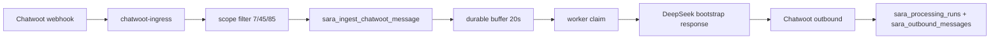
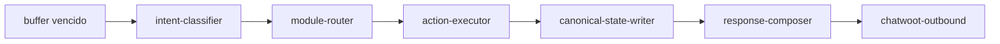
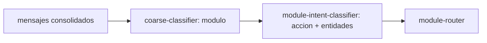

# INFORME_ANALISIS_ARQUITECTURA_FEATURES.md - SARA

Fecha: 2026-06-02
Estado: ANALISIS CORREGIDO CON REVISION EXPERTA
Objetivo del documento: entregar a un experto todo el contexto operativo, arquitectonico y funcional de SARA antes de iniciar desarrollo de features.

## 1. Resumen ejecutivo

SARA es un sistema operativo personal, API-first, orientado a convertir direccion estrategica en ejecucion sostenida.

No es solo un gestor de tareas. El objetivo central es ayudar al operador a alcanzar objetivos reales mediante:
- captura de datos
- seguimiento de progreso
- analisis de patrones
- activacion de protocolos
- consecuencias visibles
- adaptacion continua

La regla madre conceptual es:

> Las decisiones importantes deben basarse en datos, protocolos y direccion, no en el estado emocional del momento.

El sistema ya tiene un primer flujo vertical operativo:
- recibe mensajes desde Chatwoot
- filtra alcance autorizado
- agrupa mensajes durante 20 segundos
- persiste trazabilidad en Supabase/Postgres
- procesa con DeepSeek en modo bootstrap
- responde en Chatwoot
- registra procesamiento y salida

Este flujo es intencionalmente minimo. Todavia no ejecuta acciones reales de dominio. El siguiente paso es incorporar el primer modulo funcional manteniendo la arquitectura modular.

## 1.1 Correcciones incorporadas desde revision experta

La revision experta valida la arquitectura general, pero marca ajustes que pasan a ser decisiones recomendadas:

- No guardar `current_value` como campo mutable en planes u objetivos. El progreso debe calcularse desde eventos o, si hace falta performance, desde proyecciones que solo actualiza el writer canonico.
- Agregar `session-context` a la Fase A. El contexto conversacional no es un detalle de Gym: tambien afecta tareas, confirmaciones y referencias ambiguas.
- Implementar clasificacion LLM en dos pasos: primero modulo o area, despues accion y entidades dentro del modulo.
- Definir desde el inicio un motor real de protocolos: disparo por eventos del writer canonico y/o jobs periodicos, con reglas JSON versionadas.
- Agregar una entidad de dia operativo (`sara_daily_log` o `sara_daily_snapshots`) para check-in, energia, sueno, intencion diaria y cierre.
- Tratar Delta como bounded context posiblemente separado. La recomendacion experta es que Delta viva como servicio/app aparte y que SARA lo consulte via API.
- Agregar confirmacion explicita antes de acciones destructivas usando `session-context`.
- Agregar metricas de uso del propio sistema.
- Versionar schemas tambien en `sara_action_runs` y `sara_state_events`, no solo en `intent-classifier`.

## 2. Estado operativo actual

### 2.1 Runtime

- Backend: Node.js + TypeScript + Fastify.
- Base: Supabase/Postgres compartida con otras apps.
- LLM: DeepSeek.
- Canal actual: Chatwoot.
- Deploy: Docker Swarm + Traefik en VPS.
- URL publica: `https://sara.codexa.uy`.
- Directorio VPS: `/opt/sara`.
- Repo Git: `main`.

### 2.2 Alcance Chatwoot vigente

SARA solo debe procesar mensajes entrantes que coincidan con:

- `account.id = 7`
- `inbox.id = 45`
- `conversation.id = 85`
- `event = message_created`
- `message_type = incoming`

Todo lo demas debe ignorarse.

Importante: el inbox recibe mensajes de muchos numeros. La barrera de seguridad funcional actual es la conversacion exacta `85`.

### 2.3 Estado de seguridad

- Los secretos reales viven en `.env.local` y entorno del VPS.
- No se deben versionar secretos.
- La base compartida solo se puede tocar mediante objetos con prefijo `sara_`.
- Pendiente: recuperar secreto HMAC de Chatwoot y activar `CHATWOOT_VERIFY_SIGNATURE=true`.
- Estado actual temporal: `CHATWOOT_VERIFY_SIGNATURE=false`.

### 2.4 Tablas y funciones propias actuales

Objetos existentes con prefijo `sara_`:
- `sara_webhook_deliveries`
- `sara_messages`
- `sara_message_buffers`
- `sara_buffer_messages`
- `sara_processing_runs`
- `sara_outbound_messages`
- RPCs de ingest, claim, complete y fail de buffers

La trazabilidad actual registra:
- entrega webhook aceptada
- mensaje entrante
- buffer asociado
- mensajes agrupados
- ejecucion del worker
- resultado outbound

## 3. Ley de arquitectura

La ley primera es:

> No mezclar capas de responsabilidad.

Esto implica:
- cada funcionalidad pertenece a un modulo propietario
- los modulos se comunican por contratos publicos versionados
- cada cambio funcional incluye tests
- agregar un modulo no debe romper comportamiento existente
- toda entrada, decision, ejecucion y escritura debe ser trazable
- solo el writer canonico puede escribir estado agregado
- no se confirma una accion hasta ejecutarla y verificarla

## 4. Capas objetivo de SARA

La arquitectura conceptual se adapta a estas capas:

1. `C1 Contexto`
   Construye estado operativo vigente.

2. `C2 Origen`
   Detecta superficie de entrada: Chatwoot, API, cron, importacion o accion manual.

3. `C3 Clasificacion`
   Interpreta mensajes y produce intencion estructurada.

4. `C4 Routing`
   Selecciona modulo propietario.

5. `C5 Decision de dominio`
   Aplica reglas del modulo.

6. `C6 Politica y recomendacion`
   Aplica protocolos, prioridades y consecuencias.

7. `C7 Ejecucion`
   Ejecuta persistencia o accion solicitada.

8. `C8 Writer canonico`
   Es el unico punto de escritura del estado agregado y auditoria.

9. `Respuesta final`
   Redacta salida al usuario solo despues de tener resultado verificable.

## 5. Flujo actual de Chatwoot



Estado actual: el paso `DeepSeek bootstrap response` es temporal. Debe reemplazarse por:



## 6. Modulos actuales

### 6.1 `chatwoot-ingress`

Responsabilidad:
- recibir webhook
- validar firma si esta habilitada
- filtrar scope autorizado
- descartar mensajes salientes
- crear `trace_id`
- enviar a persistencia

No debe:
- llamar LLM
- decidir intencion
- ejecutar acciones
- redactar respuesta final

### 6.2 `message-buffer`

Responsabilidad:
- agrupar mensajes por conversacion
- renovar ventana de 20 segundos
- evitar doble procesamiento
- permitir recuperacion de locks viejos

No debe:
- interpretar contenido
- decidir modulo
- ejecutar acciones

### 6.3 `bootstrap-processor`

Responsabilidad actual temporal:
- reclamar buffers vencidos
- enviar mensajes consolidados a DeepSeek
- enviar respuesta a Chatwoot
- registrar resultado

Este modulo debe ser retirado o reducido cuando existan:
- `intent-classifier`
- `module-router`
- `action-executor`
- `response-composer`

### 6.4 `chatwoot-outbound`

Responsabilidad:
- enviar respuesta a Chatwoot
- devolver ID de mensaje saliente

No debe:
- decidir contenido
- confirmar acciones

### 6.5 `supabase-store`

Responsabilidad:
- encapsular llamadas RPC a Supabase
- mantener persistencia de buffers y resultados

No debe:
- mezclar reglas de dominio
- conocer features especificas

## 7. Modulos que faltan antes de features complejas

### 7.1 `intent-classifier`

LLM 1. Debe producir JSON versionado.

Correccion experta: no conviene que sea una unica llamada LLM que conozca todas las acciones de todos los modulos. A medida que existan 9 modulos y decenas de acciones, un prompt unico degrada precision y es mas dificil de depurar.

El clasificador debe ser de dos pasos:

1. `coarse-classifier`
   Detecta area o modulo probable.

2. `module-intent-classifier`
   Dentro del modulo detectado, clasifica accion y extrae entidades.



Entrada:
- mensajes consolidados
- contexto disponible
- `trace_id`

Salida propuesta:

```json
{
  "schema_version": "intent.v1",
  "intent": "create_note",
  "confidence": 0.86,
  "required_module": "notes",
  "requested_action": "create",
  "entities": {},
  "missing_data": [],
  "reasoning_summary": "El usuario quiere registrar una nota."
}
```

Regla:
- si la confianza es baja o faltan datos, no ejecutar accion.
- responder pidiendo aclaracion.
- el LLM clasifica y redacta; las reglas de negocio las aplica codigo.
- el LLM nunca decide ejecutar una accion por si mismo.

### 7.2 `module-router`

Responsabilidad:
- mapear intencion a modulo propietario
- validar que el modulo existe
- aplicar fallback seguro

No debe:
- decidir reglas de dominio
- escribir estado

### 7.3 `action-executor`

Responsabilidad:
- llamar el contrato del modulo funcional
- devolver resultado verificable

Salida:

```json
{
  "status": "executed",
  "evidence": {},
  "state_changes": [],
  "error": null
}
```

### 7.4 `canonical-state-writer`

Responsabilidad:
- escribir eventos de estado
- actualizar proyecciones agregadas si existen
- dejar auditoria

Debe ser el unico writer de estado agregado.

### 7.5 `response-composer`

LLM 2. Redacta respuesta final.

Entrada:
- mensajes originales
- intencion
- resultado real de accion
- evidencia

Regla critica:
- no puede confirmar acciones no ejecutadas
- si hubo error, debe informar el error real

### 7.6 `confirmation-manager`

Responsabilidad:
- detectar acciones destructivas o de alto impacto
- crear estado `awaiting_confirmation` en `sara_session_contexts`
- bloquear ejecucion hasta recibir confirmacion explicita
- expirar confirmaciones viejas

Acciones que requieren confirmacion:
- borrar
- archivar definitivamente
- cancelar
- modificar datos sensibles
- ejecutar cambios con impacto financiero o agenda

Contrato sugerido:

```json
{
  "requires_confirmation": true,
  "confirmation_id": "uuid",
  "summary": "Archivar plan Salir de deudas",
  "expires_at": "2026-06-02T23:00:00Z"
}
```

Regla:
- el usuario debe confirmar explicitamente.
- respuestas ambiguas no ejecutan.

## 8. Forma de trabajo con agentes

### 8.1 Roles

- Nosotros: planificamos, definimos contrato, validamos y aprobamos.
- opencode: ejecuta trabajo pesado, documenta, testea y commitea.
- Experto externo: revisa arquitectura, riesgos y orden de implementacion.

### 8.2 Regla para opencode

opencode no toma decisiones de producto ni arquitectura.

Debe recibir:
- task aprobada
- alcance permitido
- alcance prohibido
- archivos esperados
- contratos de entrada/salida
- tests obligatorios
- validaciones
- criterio de aceptacion

Si falta informacion, debe bloquearse y pedir decision.

Documento rector:
- `docs/agents/OPENCODE_EXECUTOR_PROTOCOL.md`

### 8.3 Flujo operativo

1. Nosotros disenamos feature y task.
2. Se consulta experto si hay duda de arquitectura.
3. Se entrega task cerrada a opencode.
4. opencode implementa, testea, documenta y commitea.
5. Nosotros revisamos diff y evidencia.
6. Se aprueba o se piden correcciones.
7. Deploy solo si esta explicitamente autorizado.

## 9. Modelo funcional objetivo

Las features de `MASTER.md` y `FEATURES.md` se deben adaptar a la arquitectura modular de SARA. No se debe implementar como un bloque monolitico.

El nucleo funcional deberia organizarse asi:

- `areas`
- `session-context`
- `daily-log`
- `plans`
- `objectives`
- `projects`
- `tasks`
- `notes`
- `protocols`
- `events`
- `consequences`
- `usage-metrics`
- `reviewer`
- modulos verticales: `finance`, `delta`, `gym`, `health`, `barberox`

Cada modulo debe tener:
- contrato publico
- tablas `sara_`
- eventos propios
- tests
- documentacion
- integracion con writer canonico

## 10. Recomendacion de orden de implementacion

### Fase A: infraestructura funcional minima

Antes de implementar Delta, Gym o Reviewer, conviene construir un nucleo comun:

1. `sara_events`
2. `sara_session_contexts`
3. `sara_daily_log`
4. `sara_usage_metrics`
5. `sara_areas`
6. `sara_plans`
7. `sara_objectives`
8. `sara_tasks`
9. `sara_notes`
10. `sara_protocols`

Motivo:
- muchas features dependen de Plan, Objetivo, Tarea, Evento y Nota.
- evita duplicar modelos por modulo.
- habilita trazabilidad y consecuencias desde el principio.
- permite resolver referencias ambiguas como "completa la de ir al banco".
- permite confirmacion antes de acciones destructivas.
- permite responder `/estado` sin construir el Agente Ejecutivo completo.

### Fase A.1: contexto conversacional

Tabla propuesta:
- `sara_session_contexts`

Responsabilidad:
- guardar estado efimero de la conversacion
- recordar accion pendiente
- guardar entidad en foco
- manejar `awaiting_confirmation`
- expirar contexto viejo

No debe:
- ser fuente canonica de verdad
- reemplazar tablas de dominio
- almacenar historiales largos que ya viven en eventos

Casos:
- "completa la de ir al banco"
- "si, confirmo"
- "cancelalo"
- sesion Gym activa

### Fase A.2: dia operativo

Tabla propuesta:
- `sara_daily_log`

Campos iniciales:
- `id`
- `date`
- `wake_energy`
- `sleep_hours`
- `morning_intention`
- `evening_review`
- `created_at`
- `updated_at`

Objetivo:
- representar el dia como unidad operativa
- alimentar `/estado`, Reviewer y Agente Ejecutivo
- diferenciar bajo rendimiento por mala recuperacion versus falta de ejecucion

### Fase A.3: metricas de uso

Tabla propuesta:
- `sara_usage_metrics`

Metricas iniciales:
- mensajes procesados por dia
- acciones ejecutadas
- clasificaciones con baja confianza
- modulos utilizados
- errores por modulo

Objetivo:
- saber si SARA se usa realmente
- detectar modulos confusos
- medir salud operativa del sistema

### Fase B: comprension y routing

1. `intent-classifier`
2. `module-router`
3. contratos de accion
4. `response-composer`

Motivo:
- sin esto, cada feature tendria que interpretar lenguaje por separado.
- separa LLM de reglas de negocio.

### Fase C: primer modulo funcional simple

Recomendacion: empezar por `notes` o `tasks`.

Motivo:
- bajo riesgo
- mucho valor inmediato por WhatsApp
- permite probar ejecucion real sin reglas complejas
- habilita datos para Reviewer

### Fase D: planes y objetivos

Implementar:
- Planes
- Objetivos
- progreso
- eventos
- preguntas de estado

### Fase E: protocolos y consecuencias

Implementar:
- evaluador de condiciones
- activacion de protocolos
- motor de consecuencias

### Fase F: modulos verticales

Luego:
- Finanzas
- Delta
- Gym
- Salud
- Barberox

## 11. Feature 001 - Planes

### Proposito

Representar resultados importantes que requieren semanas o meses.

Ejemplos:
- salir de deudas
- 10 clientes Barberox
- mudanza Montevideo

### Entidades propuestas

Tabla:
- `sara_plans`

Campos base:
- `id`
- `area_id`
- `name`
- `description`
- `priority`
- `status`
- `start_date`
- `target_date`
- `progress_type`
- `target_value`
- `created_at`
- `updated_at`
- `archived_at`

No incluir como campo mutable directo:
- `current_value`

Regla:
- `current_value` se calcula desde `sara_events`.
- Si hace falta performance, se crea una proyeccion materializada o tabla de snapshot que solo puede actualizar el writer canonico.
- Ningun modulo funcional debe actualizar progreso agregado directamente.

Estados:
- `active`
- `paused`
- `completed`
- `archived`

Eventos:
- `plan_created`
- `plan_updated`
- `plan_paused`
- `plan_reactivated`
- `plan_completed`
- `plan_archived`

### Modulo propietario

`plans`

Contratos:
- `plans.create`
- `plans.update`
- `plans.pause`
- `plans.reactivate`
- `plans.archive`
- `plans.get_status`

### Implementacion sugerida

1. Crear migracion `sara_plans`.
2. Crear contratos TypeScript del modulo.
3. Crear repositorio de datos del modulo.
4. Crear servicio de dominio `plansService`.
5. Registrar eventos mediante writer canonico.
6. Agregar tests unitarios y de integracion.
7. Integrar al router solo despues de tener intent-classifier estable.

### Preguntas para experto

- Resuelto por revision experta: `current_value` no debe ser campo mutable directo. Debe calcularse desde eventos o desde proyeccion controlada por writer canonico.
- El progreso financiero debe compartir modelo con Finanzas o solo referenciarlo?
- Como versionar `progress_type = custom` sin convertirlo en un campo ambiguo?

## 12. Feature 002 - Objetivos

### Proposito

Dividir un plan en hitos medibles.

Ejemplo:
- plan: salir de deudas
- objetivos: 22k a 15k, 15k a 8k, 8k a 0

### Entidades propuestas

Tabla:
- `sara_objectives`

Campos:
- `id`
- `plan_id`
- `name`
- `target_value`
- `deadline`
- `priority`
- `status`
- `created_at`
- `updated_at`

No incluir como campo mutable directo:
- `current_value`

Regla:
- el avance del objetivo se calcula desde eventos asociados.
- si se necesita una lectura rapida, usar proyeccion/snapshot actualizada solo por writer canonico.

Eventos:
- `objective_started`
- `objective_updated`
- `objective_completed`
- `objective_stalled`

### Modulo propietario

`objectives`

### Implementacion sugerida

Debe depender de `plans`, no duplicar plan.

El calculo de avance debe estar en API Core, no en DB ni frontend.

### Preguntas para experto

- Un objetivo debe pertenecer siempre a un plan?
- Conviene permitir objetivos independientes?
- Como modelar hitos secuenciales versus paralelos?

## 13. Feature 003 - Tareas

### Proposito

Unidad minima de avance.

### Entidades propuestas

Tabla:
- `sara_tasks`

Campos:
- `id`
- `project_id`
- `plan_id`
- `objective_id`
- `title`
- `description`
- `priority`
- `status`
- `estimated_minutes`
- `actual_minutes`
- `impact_score`
- `cost_of_delay`
- `due_date`
- `created_at`
- `updated_at`
- `completed_at`

Estados:
- `pending`
- `doing`
- `completed`
- `blocked`
- `recovery`

Eventos:
- `task_created`
- `task_started`
- `task_completed`
- `task_blocked`
- `task_recovered`

### Modulo propietario

`tasks`

### Implementacion sugerida

Recomendado como primera feature ejecutable si se quiere accion real por Chatwoot.

Primer alcance minimo:
- crear tarea
- listar tareas de hoy
- completar tarea
- responder consecuencia simple si no se hace hoy

### Preguntas para experto

- `project_id` debe ser obligatorio desde el inicio?
- Se permite tarea suelta sin plan?
- `cost_of_delay` es manual, calculado o mixto?

## 14. Feature 004 - Notas

### Proposito

Capturar conocimiento y observaciones.

Comando esperado:
- `/nota`

Ejemplos:
- `/nota delta La aprobacion demora mas de lo esperado`
- `/nota gym Dormi 8 horas y rendi mejor`

### Entidades propuestas

Tabla:
- `sara_notes`

Campos:
- `id`
- `area_id`
- `note_type`
- `content`
- `source`
- `related_entity_type`
- `related_entity_id`
- `tags`
- `created_at`

Tipos:
- `aprendizaje`
- `idea`
- `problema`
- `riesgo`
- `mejora`
- `observacion`

Eventos:
- `note_created`
- `note_linked`

### Modulo propietario

`notes`

### Implementacion sugerida

Recomendado como primera feature si se prioriza captura rapida y bajo riesgo.

Primer alcance minimo:
- crear nota desde Chatwoot
- clasificar tipo con LLM o regla simple
- asociar a area si el usuario la indica
- registrar evento
- responder con ID de nota y resumen

### Preguntas para experto

- La clasificacion de nota debe ser automatica desde el inicio?
- Usar `related_entity_type/id` polimorfico o tablas puente por entidad?
- Las notas deben alimentar Reviewer automaticamente o mediante job separado?

## 15. Feature 005 - Protocolos

### Proposito

Definir comportamiento automatico con formato:

```text
evento
condicion
accion
```

Ejemplo:
- energia menor a 5 durante 3 dias
- accion: reducir carga semanal

### Entidades propuestas

Tablas:
- `sara_protocols`
- `sara_protocol_rules`
- `sara_protocol_runs`

Tipos:
- `global`
- `plan`
- `objective`
- `project`
- `routine`

Eventos:
- `protocol_created`
- `protocol_triggered`
- `protocol_action_suggested`
- `protocol_action_executed`

### Modulo propietario

`protocols`

### Implementacion sugerida

No conviene implementarla como primera feature. Es central, pero depende de:
- eventos confiables
- entidades base
- motor de condiciones
- writer canonico
- politica de accion

Primer alcance seguro:
- protocolos pasivos que generan recomendaciones
- no ejecutar acciones automaticas hasta tener auditoria madura
- reglas JSON simples versionadas
- ejecucion disparada por el writer canonico cuando se emiten eventos relevantes
- job periodico para condiciones temporales, por ejemplo "energia < 5 durante 3 dias"

### Motor de condiciones propuesto

Componentes:
- `protocol-rule-evaluator`
- `protocol-trigger-runner`
- `protocol-scheduler`

Disparadores:
- `on_event`: se evalua inmediatamente despues de escribir un evento canonico.
- `scheduled`: se evalua por job periodico para condiciones acumuladas o temporales.

Formato inicial recomendado:

```json
{
  "schema_version": "protocol_rule.v1",
  "trigger": "daily_log_updated",
  "condition": {
    "metric": "wake_energy",
    "operator": "<",
    "value": 5,
    "window_days": 3
  },
  "action": {
    "type": "recommendation",
    "recommendation": "activar protocolo de recuperacion"
  }
}
```

Regla:
- al inicio, los protocolos recomiendan.
- no ejecutan acciones destructivas o de alto impacto sin confirmacion explicita.

### Preguntas para experto

- Resuelto por revision experta: empezar con reglas JSON simples; DSL solo si JSON se vuelve ilegible.
- Como versionar condiciones?
- Protocolos automaticos pueden ejecutar acciones o solo recomendar?

## 16. Feature 006 - Delta

### Proposito

Controlar pedidos, produccion y rentabilidad.

Subfeatures:
- productos
- pedidos
- produccion
- costos
- caja
- riesgo

### Modulos sugeridos

No hacer un unico modulo gigante. Separar:
- `delta-products`
- `delta-orders`
- `delta-production`
- `delta-costs`
- `delta-cashflow`
- `delta-risk`

### Entidades propuestas

Tablas:
- `sara_delta_products`
- `sara_delta_orders`
- `sara_delta_order_stages`
- `sara_delta_costs`
- `sara_delta_cash_movements`
- `sara_delta_risk_snapshots`

### Implementacion sugerida

No empezar por Delta como primera feature. Tiene demasiadas reglas y dependencias.

Correccion experta:
- Delta no deberia vivir como modulo interno fuerte de SARA si crece hacia pedidos, produccion, costos y caja.
- La recomendacion es tratar Delta como bounded context separado, idealmente servicio/app aparte en el mismo Swarm.
- SARA deberia consultar Delta via API y registrar eventos/resumenes propios cuando esos datos afecten decisiones personales.

Orden recomendado:
1. productos
2. pedidos
3. etapas de produccion
4. costos directos
5. caja por pedido
6. riesgo de entrega

### Preguntas para experto

- Resuelto por revision experta: Delta deberia tender a bounded context separado.
- Como evitar que costos generales contaminen rentabilidad por pedido?
- Que nivel de detalle de produccion aporta valor real al inicio?

## 17. Feature 007 - Gym

### Proposito

Guiar sesiones de entrenamiento y registrar progreso.

Flujo:
- inicio
- ejercicio
- serie
- descanso
- evaluacion
- cierre

### Entidades propuestas

Tablas:
- `sara_gym_exercises`
- `sara_gym_routines`
- `sara_gym_sessions`
- `sara_gym_sets`
- `sara_gym_session_reviews`

### Modulo propietario

`gym`

### Implementacion sugerida

Requiere manejo de sesion activa por Chatwoot.

Antes de implementarlo, conviene crear:
- `session-context`
- estado conversacional
- comandos estructurados

Primer alcance seguro:
- `/gym iniciar`
- registrar serie
- cerrar sesion
- resumen simple

### Preguntas para experto

- El estado conversacional debe vivir en `sara_session_contexts`?
- Como manejar temporizadores sin depender de mensajes del usuario?
- Progresion automatica desde el inicio o posterior?

## 18. Feature 008 - Agente Ejecutivo

### Proposito

Ser la puerta de entrada unica.

Debe responder:
- como voy?
- que es importante hoy?
- que planes estan en riesgo?
- que aprendi esta semana?

### Modulo propietario

`executive-agent`

### Implementacion sugerida

No debe ser el primer modulo de dominio. Depende de datos.

Debe consumir:
- eventos
- planes
- objetivos
- tareas
- notas
- protocolos
- health/checkins

Responsabilidad:
- sintetizar
- priorizar
- explicar
- pedir aclaraciones

No debe:
- escribir estado directamente
- ejecutar acciones sin pasar por action-executor

### Preguntas para experto

- Que datos minimos necesita para generar valor?
- Debe tener memoria propia o solo leer proyecciones?
- Como evitar recomendaciones no basadas en datos suficientes?

## 19. Feature 009 - Reviewer

### Proposito

Convertir datos historicos en decisiones.

Analiza:
- sueno
- energia
- tareas
- gastos
- notas
- objetivos

Genera:
- patrones
- alertas
- ajustes
- recomendaciones

### Modulo propietario

`reviewer`

### Implementacion sugerida

Debe ser un job periodico o proceso bajo demanda, no parte del webhook directo.

Tablas sugeridas:
- `sara_reviews`
- `sara_review_findings`
- `sara_recommendations`

Primer alcance:
- review semanal basado en notas y tareas
- salida como reporte
- sin ejecutar cambios automaticos

### Preguntas para experto

- LLM revisa datos crudos o summaries canonicos?
- Como versionar recomendaciones y medir si fueron utiles?
- Cuando una recomendacion se convierte en protocolo?

## 20. Entidades base recomendadas

Se recomienda crear un documento posterior:

- `docs/ENTITY_CATALOG.md`

Debe documentar:
- `Area`
- `Plan`
- `Objective`
- `Project`
- `Task`
- `Routine`
- `Event`
- `Note`
- `Protocol`
- `Debt`
- `Payment`
- `Product`
- `Order`
- `GymSession`
- `GymSet`
- `Review`
- `Recommendation`

Para cada entidad:
- proposito
- owner module
- tabla
- campos
- invariantes
- eventos emitidos
- relaciones
- tests esperados

## 21. Decisiones de arquitectura despues de revision experta

1. Modelo de datos:
   CRUD con eventos. Event sourcing puro no se justifica para un sistema personal en esta etapa.

2. Progreso:
   `current_value` se calcula desde eventos. Solo usar proyecciones si aparece problema real de performance.

3. `sara_events`:
   Debe incluir como minimo `schema_version`, `event_type`, `entity_type`, `entity_id`, `payload`, `trace_id`, `created_at`.

4. Notas polimorficas:
   Empezar con `related_entity_type` y `related_entity_id`. Si la disciplina se vuelve un problema, migrar a tablas puente.

5. Protocolos:
   Empezar con reglas JSON simples. DSL solo si las reglas se vuelven ilegibles.

6. Contexto conversacional:
   Usar `sara_session_contexts` para lo efimero. Las tablas de dominio siguen siendo la fuente permanente.

7. Primera feature:
   `notes`, sin dudas.

8. Limitar LLM:
   El LLM clasifica y redacta. El codigo decide, valida y ejecuta.

9. Writer canonico:
   Al inicio puede ser una funcion TypeScript invocada por `action-executor`; no hace falta servicio HTTP separado.

10. Trazabilidad:
    Registrar eventos en `sara_state_events` o `sara_events`, con archivado/TTL futuro si crece demasiado.

11. Versionado:
    `schema_version` debe existir tambien en `sara_action_runs`, `sara_state_events` y eventos canonicos.

12. Acciones destructivas:
    Requieren confirmacion explicita usando `session-context.awaiting_confirmation`.

## 22. Recomendacion del primer modulo

Hay dos candidatos fuertes.

### Opcion recomendada A: `notes`

Ventajas:
- bajo riesgo
- captura conocimiento rapido
- poco acoplamiento
- alimenta Reviewer futuro
- ideal para validar clasificador, router, executor y writer

Primer slice:
- usuario envia `/nota ...`
- intent-classifier detecta `notes.create`
- notes module valida payload
- writer registra `sara_notes` y `sara_events`
- response-composer confirma con evidencia

### Opcion recomendada B: `tasks`

Ventajas:
- habilita ejecucion diaria
- conecta con motor de consecuencias
- permite preguntas como "que hago hoy?"

Riesgo:
- requiere mas decisiones sobre proyectos, planes y prioridades.

Primer slice:
- crear tarea
- listar tareas pendientes
- completar tarea
- calcular consecuencia simple

## 23. Recomendacion de arquitectura para primera feature

Antes de la feature de dominio, implementar el esqueleto:

1. `intent-classifier`
2. `module-router`
3. `action-executor`
4. `response-composer`
5. `sara_action_runs`
6. `sara_state_events` o `sara_events`

Luego implementar `notes.create` como primer modulo real.

Esto evita construir una feature acoplada al bootstrap actual.

## 24. Riesgos actuales

### Riesgo 1: firma Chatwoot desactivada

Mitigacion:
- activar HMAC cuando se consiga el secreto.

### Riesgo 2: documentos historicos con scope viejo

Algunos documentos historicos aun mencionan `6/44/20`. El scope real operativo es `7/45/85`.

Mitigacion:
- normalizar `docs/ARQUITECTURA_CHATWOOT_V1.md` y `docs/SECURITY.md`.

### Riesgo 3: bootstrap LLM responde sin modulos reales

Mitigacion:
- mantener prompt que prohibe afirmar acciones.
- retirar bypass cuando entre `intent-classifier`.

### Riesgo 4: features muy grandes

Delta, Protocolos y Reviewer pueden crecer demasiado.

Mitigacion:
- cortar por slices pequenos con contrato y tests.

## 25. Proximo paso sugerido

Antes de pasar trabajo a opencode:

1. Crear `ENTITY_CATALOG.md` minimo para entidades base.
2. Definir `sara_events`, `sara_session_contexts`, `sara_daily_log` y `sara_usage_metrics`.
3. Crear task cerrada para opencode del esqueleto modular.
4. Implementar pipeline de clasificacion gruesa, clasificacion fina, routing, action-executor, writer y response-composer.
5. Implementar `notes.create` como primer modulo real.
6. Mantener Delta fuera del primer ciclo.

## 26. Borrador de encargo futuro para opencode

```text
Task ID: TASK-20260602-004
Objetivo: Implementar esqueleto de clasificacion, routing, ejecucion y respuesta final sin feature de dominio compleja.
Contexto: SARA ya recibe mensajes Chatwoot 7/45/85, bufferiza y responde via bootstrap DeepSeek.
Alcance permitido:
- crear contratos intent-classifier, module-router, action-executor, response-composer
- agregar tablas sara_action_runs y sara_state_events si se aprueba
- mantener bootstrap como fallback
- tests unitarios por modulo
Alcance prohibido:
- implementar Delta, Gym, Finanzas o Protocolos
- tocar objetos sin prefijo sara_
- cambiar deploy o secretos
- confirmar acciones no ejecutadas
Validaciones:
- npm run typecheck
- npm test
- npm run build
Documentacion:
- actualizar CONTRATOS, TEST_SUITE, CHANGELOG
Commit esperado:
- feat(TASK-20260602-004): agregar pipeline modular de intencion y acciones
Si falta informacion:
- bloquear y pedir decision
```

## 27. Cierre

SARA ya tiene base tecnica suficiente para iniciar features, pero conviene no construirlas directamente sobre el bypass actual.

La direccion recomendada es:

1. consolidar pipeline modular
2. implementar `notes` como primer modulo real
3. agregar `tasks`
4. agregar `plans/objectives`
5. recien despues avanzar en protocolos, reviewer y modulos verticales grandes

La prioridad no es velocidad de codigo. La prioridad es que cada modulo nuevo deje al sistema mas facil de extender, mas trazable y mas fiel a la regla madre.
